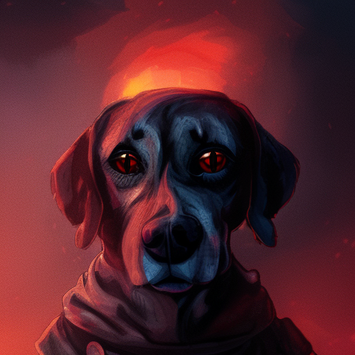

Lahminewski c'est moi. Coucou !!!

## Réseaux sociaux
* [Instagram](https://www.instagram.com/lahminewski.lab/)
* [Pixelfed](https://pixelfed.social/lahminewski.lab)
* [Telegram](https://t.me/lahminewskiLab)

## Autres liens
* [Scribouilli](https://lahminewski.github.io/note/)
* [Site web 🐝](https://lahminewski-lab.net/) 
